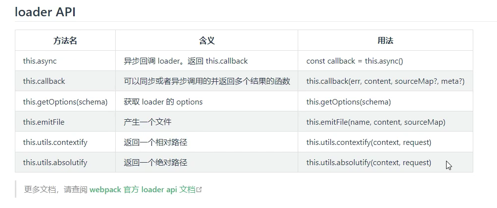

# 同步loader

~~~js
// 针对某种类型的文件只有这一个loader去处理时，直接return出去处理后的文件内容即可
module.exports = function(content) {
  return content
}

// 对于配合其它loader的loader，一般使用this.callback代替return，旨在传递更多的信息给下一个loader
module.exports = function(content, map, meta) {
  /*
  	this.callback
  		第一个参数：err代表是否有错误
  		第二个参数：content代表处理后的内容，等价于return的内容
  		第三个参数：传递source-map
  		第四个参数：mata，即给下一个loader传递的参数
  */
  this.callback(null, content, map, meta);
}
~~~


# 异步loader

同步loader中不能调用异步操作（总之就是会出问题），如果想保证各个loader之间执行顺序的正常，就需要用异步loader，说白了就是webpack对于异步操作的一种语法要求

~~~js
// 异步loader
module.exports = function(content, map, meta) {
  const callback = this.async();
  
  setTimeout(() => {
    console.log("第一个loader->异步loader");
    callback(null, content, map, meta); // 意思就是在某个异步操作完成后再通过调用callback方法来触发下一个loader的执行
  }, 1000)
}

// 同步loader
module.exports = function(content, map, meta) {
	this.callback(null, content, map, meta);
}
~~~


# raw loader

一个loader（loader函数）上如果`raw`属性为`true`，那么他接收到的`content`即为二进制数据。

~~~js
module.exports = function (content) {
  console.log(content); //输出上一个loader返回数据的二进制格式
  return content;
}

module.exports.raw = true;
~~~


# pitch loaer

给`loader`函数上添加`pitch`属性，是一个方法，那么loader的执行顺序即为从左向右执行各loader的pitch方法，然后再从右向左执行loader方法（normal loader），如果`pitch`方法`return`，那么会触发熔断，也就是`pitch`方法执行完之后直接从此`loader`开始从右向左执行其它loader的normal方法（不包括pitch loader的normal）

~~~js
module.exports = {
  //...
  module: {
    rules: [
      {
        //...
        use: ['a-loader', 'b-loader', 'c-loader'],
      },
    ],
  },
};
~~~

将会发生这些步骤：

```diff
|- a-loader `pitch`
  |- b-loader `pitch`
    |- c-loader `pitch`
      |- requested module is picked up as a dependency
    |- c-loader normal execution
  |- b-loader normal execution
|- a-loader normal execution
```

如果 `b-loader` 的 `pitch` 方法返回了一些东西：

上面的步骤将被缩短为：

```diff
|- a-loader `pitch`
  |- b-loader `pitch` returns a module
|- a-loader normal execution
```

当然pitch loader还有传参以及`require`[递归解析](https://juejin.cn/post/7058652098174386213)的一些特点，就不细说了。


# loader API




# style-loader

[源码解析](https://github.com/jinrd123/style-loader-demo)

~~~js
module.exports.pitch = function(remainingRequest) {
  const relativePath = remainingRequest
  .split("!")
  .map((absolutePath) => {
    return this.utils.contextify(this.context, absolutePath);
  })
  .join("!");
  
  const script = `
  	import style from "!!${relativePath}";
  	const styleEl = document.createElement("style");
  	styleEl.innerHTML = style;
  	document.head.appendChild(styleEl);
  `;
  
  return script;
}
~~~


# plugins

说白了就是在webpack打包的各个生命周期中添加回调函数，从而增加webpack打包的逻辑，增强功能

~~~js
/*
	1.webpack加载webpack.config.js中的所有配置，此时就会执行new xxxPlugin()，执行插件的constructor
	2.webpack创建compiler对象，一个本次打包的唯一对象，上面记录了本次打包的所有信息，什么loader等等
	3.遍历所有plugins中的插件实例，执行他们的apply方法
		插件正是通过在apply方法中给webpack暴露出来的生命周期添加事件回调来发挥作用的
	4.执行编译流程
*/

class TestPlugin {
  construtor() {
    console.log("webpack打包之前，读取webpack配置时就会输出");
  }
  apply(compiler) {
    console.log("从此方法中给各个生命周期添加回调");
    // 查文档即可，各个hook该如何注册，hook名是什么、回调的参数是什么、回调是异步的还是同步的（并行的还是串行的）
    // compiler.hooks.someHook.tap(<plugin名>, <回调函数>);
    
    // 由文档可知，environment 是同步钩子，所以需要用tap注册(tap对应同步)，文档里这个钩子也没有参数，所以回调函数也没有参数（全查文档就完了）
    compiler.hooks.environment.tap("TestPlugin", () => {
      console.log("environment钩子被触发");
    })
  }
}

module.exports = TestPlugin;
~~~


# sourceMap——代码调试优化

效果：配置sourceMap后我们打包时会生成`.map`文件，浏览器会自动识别这个文件，效果就是当运行编译后的代码出错时，浏览器会根据`.map`文件给出对应源代码中哪里出了错误，也就是说因为`.map`文件的存在，我们在运行编译后的代码出错时，可以定位到源代码究竟是哪里出了问题。（对应的如果没有`.map`文件，我们运行编译后的代码报错，那就只能看到编译后的代码哪里出了错误，完全定位不到问题）

由webpack文档可知，通过顶层配置`devtool`的值来控制生成`.map`文件的效果，对于不同取值生成`map`文件有多个考量因素，比如生成很详细的`map`文件（这个`.map`文件可以给出精确到源代码行和列的错误定位），相对应的副作用可能就是构建时间长，还有能不能用于生产模式等等因素。记住如下两个即可：


## cheap-module-source-map

* 开发模式下使用`cheap-module-source-map`
* 编译速度快，但只包含行内映射，也就是说我们可以知道源代码哪一行出了问题，但不提示哪一列

~~~js
module.exports = {
  mode: "development",
  devtool: "cheap-module-source-map"
}
~~~


## source-map

* 生产模式下使用`source-map`
* 编译速度慢，出错时可以定位到源代码的行和列

~~~js
module.exports = {
  mode: "development",
  devtool: "source-map"
}
~~~


# oneOf——构建速度优化

以前的loader配置结构：

~~~js
module.exports = {
  module: {
    rules: [
      // rules里面若干个loader配置对象，一个对象对应一种文件的处理方式
      {test: /\.less$/, use: [...]},
      {...}
    ]
  }
}
~~~

如果处理一个`.css`文件，webpack打包时的行为是依次匹配`rules`数组中的所有配置规则，即使已经匹配到了处理`.css`文件的相关配置然后处理完毕了，也会继续往下匹配。

所以我们可以使用`oneOf`作为`loader`配置对象的一个属性，表示只会匹配其中一个`loader`处理规则，匹配到之后后面的`loader`规则就不用继续匹配了，可以加快构建速度

~~~js
module.exports = {
  module: {
    rules: [
      {
        oneOf: [
          // 若干个loader配置对象
          {test: /\.less$/, use: [...]},
      		{...}
        ]
      }
    ]
  }
}
~~~


# include & exclude——构建优化

对于node_modules里的代码，都是别人已经通过构建工具处理过的，所以比如js代码，就可以用`include`指定只处理`/src`文件夹下的文件。

~~~js
module.exports = {
  module: {
    rules: [
      {
        test: /\.js$/,
        include: path.resolve(__dirname, "./src"), // 只处理src下的文件，其它文件不处理
        // exclude: /node_modules/ // 排除node_modules文件夹下的文件
        loader: 'babel-loader',
      },
      {...}
    ]
  }
}
~~~


# 多进程打包——构建速度优化

内部原理就是利用cpu的多核去开进程，然后多个进程同时处理js文件。我们需要做的很简单，就是单纯的配置

我们提升打包速度，问题的核心就在于提升js（项目的主要构成）的打包速度，对js的处理，主要就是eslient、babel、Terser三个工具。

Terser是webpack内置的一个插件，在生产模式下进行代码压缩，其实就是借助Terser完成的。

当然并不是盲目的开多进程就能加快打包速度，因为进程的启动本身就有600ms左右的耗时。

~~~js
const os = require("os"); // node内置模块

const threads = os.cpus().length; // 获取cpu核数，一般作为开启多进程时的配置参数

const TerserWebpackPlugin = require("terser-webpack-plugin"); // 无需安装，webpack内置了此插件

module.exports = {
  
  // js代码处理开启多进程（配合babel）
  module: {
    rules: [
      {
        test: /\.js$/,
        include: path.resolve(__dirname, "./src"), // 只处理src下的文件，其它文件不处理
        // exclude: /node_modules/ // 排除node_modules文件夹下的文件
        use: [
          {
            loader: "thread-loader", // 开启多进程
            works: threads, // 开启的进程数量
          },
          {
            loader: "babel-loader",
            options: {
              // 开启缓存等配置
            }
          }
        ]
      },
      {...}
    ]
  },
  
  // 针对eslient开启多进程处理
  plugins: [
  	new ESLintPlugin({
    	context: path.resolve(__dirname, "./src"),
    	exclude: 'node_modules', // 默认值
    	threads, // 开启多进程并设置进程数量
    })    
  ],
   
    
  // 针对Terser代码压缩开启多进程
  optimization: {
    minimizer: [
      // new CssMinimizerPlugin(), // css压缩插件
      new TerserWebpackPlugin({
        parallel: threads, // 开启多进程并设置进程数量
      })
    ]
  }
}
~~~

注：`Terser`本身作为一个内置插件，webpack在生产模式下就会自动使用，但不会开启多进程，所以我们在`plugins`种重新配置一下，配置时开启多进程，以至于把其写在`optimization.minimizer`中是`webpack5`的推荐写法，把压缩代码用的插件都写在这里。（当前webpack从4版本向5版本的过渡过程中写在`plugins`中也没问题）


# TreeShaking

（基于esm的静态编译）打包时移除没有用到的代码，webpack生产模式下已经默认开启，无需配置。

treeshaking与Terser都是代码体积压缩，区分一下大概就是：

* terser会删除`console.log`等语句、箭头函数体只有一句时，去除 `return`、以及变量的丑化，比如将变量名 message 变为 o。
* treeshaking是基于esm的静态编译的特定，对没有用到的代码（更严谨一点是不会用到且不产生副作用）进行删除。

* 所以整个代码压缩流程可以理解为（帮助理解各自功能而已，而非真正的正确流程）：treeshaking删除代码，terser对保留下来的代码进行进一步压缩


# @babel/plugin-transform-runtime

babel默认会在每个模块（文件）中注入辅助代码，`@babel/plugin-transform-runtime`作为babel-loader的一个plugin可以解决这个问题，配置之后就会把辅助代码作为一个独立的模块来共用，避免重复定义

一般成熟的babel预设（plugin集合）都会包含这个plugin吧，也无需过多配置，了解一下他是干啥的就好。

